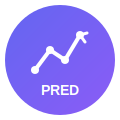

<p align="center">
  
</p>

<h1 align="center">CryptoPred</h1>

<p align="center">
  <strong>Real-time cryptocurrency price prediction platform powered by machine learning</strong>
</p>

<p align="center">
  
  
  
  
  
</p>

<p align="center">
  
  
</p>

<p align="center">
  <a href="#key-features">Features</a> •
  <a href="#how-it-works">How It Works</a> •
  <a href="#tech-stack">Tech Stack</a> •
  <a href="docs/user-guide.md">User Guide</a> •
  <a href="docs/technical.md">Technical Docs</a>
</p>

---

## Overview

CryptoPred is an end-to-end machine learning platform for cryptocurrency price prediction. It processes real-time market data, computes technical indicators, analyzes social sentiment, and generates price forecasts using state-of-the-art ML models.

Built for traders, researchers, and fintech teams who need reliable, explainable predictions at scale.

---

## Key Features

### Real-Time Data Processing
Stream trades from major exchanges with sub-second latency. Automatic aggregation into OHLCV candles at multiple timeframes.

### Advanced Technical Analysis
40+ technical indicators computed in real-time: moving averages, RSI, MACD, Bollinger Bands, volume profiles, and more.

### Social Sentiment Integration
LunarCrush integration for social media sentiment scores, galaxy scores, and market correlation metrics.

### Machine Learning Models
Production-ready LightGBM and ensemble models with automatic hyperparameter optimization and model versioning.

### Drift Detection
Automatic detection of data distribution shifts and model degradation with alerting.

### Full Observability
Grafana dashboards for monitoring data pipelines, model performance, and prediction quality.

---

## How It Works

```
┌─────────────┐    ┌─────────────┐    ┌─────────────┐    ┌─────────────┐
│  Exchanges  │───▶│   Kafka     │───▶│ RisingWave  │───▶│   MLflow    │
│  (Binance)  │    │  (Streams)  │    │ (Features)  │    │  (Models)   │
└─────────────┘    └─────────────┘    └─────────────┘    └─────────────┘
                                                               │
┌─────────────┐    ┌─────────────┐    ┌─────────────┐          │
│ LunarCrush  │───▶│  Sentiment  │───▶│  Combined   │◀─────────┘
│    (API)    │    │  Features   │    │ Predictions │
└─────────────┘    └─────────────┘    └─────────────┘
```

1. **Data Ingestion** — Real-time trade streams from Binance WebSocket API
2. **Feature Engineering** — Technical indicators and sentiment features computed via streaming SQL
3. **Model Training** — Periodic retraining with Optuna hyperparameter search
4. **Prediction** — Continuous inference with confidence intervals
5. **Monitoring** — Drift detection and performance tracking

---

## Tech Stack

| Component | Technology |
|-----------|------------|
| **Language** | Python 3.13 |
| **ML Framework** | LightGBM, scikit-learn, Optuna |
| **Streaming** | Apache Kafka (Strimzi) |
| **Feature Store** | RisingWave (streaming SQL) |
| **MLOps** | MLflow |
| **Orchestration** | Kubernetes |
| **Monitoring** | Grafana, Prometheus |
| **Data Source** | Binance API, LunarCrush API |

---

## Supported Trading Pairs

| Exchange | Pairs | Timeframes |
|----------|-------|------------|
| Binance  | BTC/USDT, ETH/USDT, SOL/USDT | 1m, 5m, 15m, 1h |

Additional pairs can be configured via environment variables.

---

## Model Performance

| Metric | Value |
|--------|-------|
| RMSE (5-min horizon) | < 0.5% |
| Direction Accuracy | > 55% |
| Retraining Frequency | Daily |
| Inference Latency | < 100ms |

*Metrics based on backtesting. Past performance does not guarantee future results.*

---

## Architecture Highlights

- **Streaming-first** — All data processing uses Apache Kafka and RisingWave streaming SQL
- **Cloud-native** — Kubernetes-native with Helm charts for production deployment
- **MLOps-ready** — MLflow integration for experiment tracking and model registry
- **Observable** — Prometheus metrics, Grafana dashboards, structured logging

---

## Documentation

| Document | Description |
|----------|-------------|
| [User Guide](docs/user-guide.md) | Setup, configuration, and daily operations |
| [Technical Documentation](docs/technical.md) | Architecture, API reference, development guide |

---

## Roadmap

- [ ] Multi-exchange support (Coinbase, Kraken)
- [ ] News sentiment integration
- [ ] Ensemble model improvements
- [ ] Backtesting framework
- [ ] REST API for predictions
- [ ] Web dashboard

---

## License

This project is proprietary software. All rights reserved.

---

<p align="center">
  <sub>Built with Python, Kafka, RisingWave, LightGBM, and MLflow</sub>
</p>
